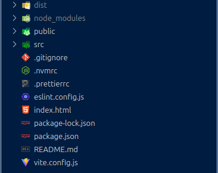
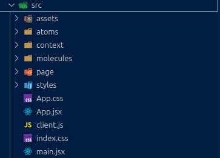
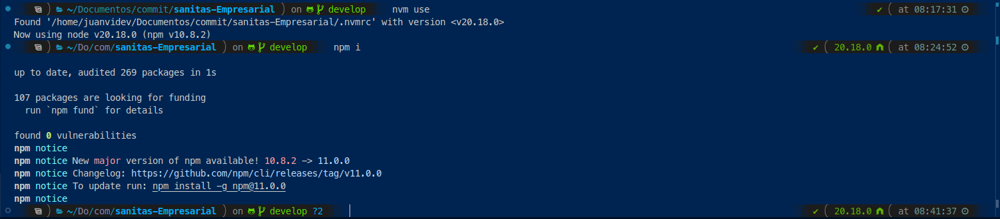
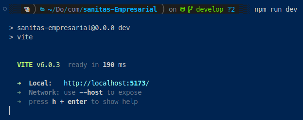
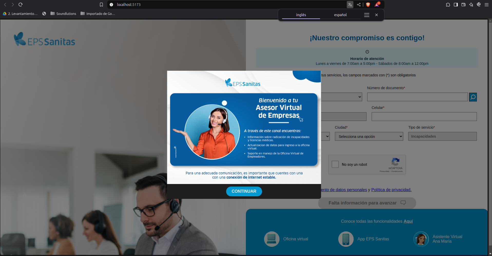

# Formulario Asesor Sanitas Empresarial

Este es un formulario solicitado para la empresa Sanitas. El objetivo de este proyecto es que una empresa tenga acceso a un asesor dentro de un chat web para resolver dudas sobre temáticas puntuales relacionadas con el tema empresarial.

Es un formulario que verifica si hace parte de los registros de EPS Sanitas para empresas; una vez el usuario pueda ingresar, se contactará con un asesor a través de un chatweb; dicho agente deberíua poder solucionar las dudas que tenga el usuario que accedió.

## Tecnologías utilizadas

- **Framework:** ReactJs
- **Versión:** 18.18.0
- **Herramientas desarrollo:** NodeJs - npm
- **Versión node:** 20.18.0
- **Versión npm:** 10.8.2

## Arquitectura

Atomic design. Componentes organizados de las necesidades más pequeñas a las más grandes.

## Estructura frontend

Landing page con un formulario de acceso para que el usuario ingrese su tipo y número de documento.

## Estructura de navegación

El proyecto se compone de la siguiente estructura de carpetas



- **dist**: Es la carpeta con el proyecto compilado. Cualquier cambio debe generar un nuevo dist y esa carpeta es la que se envía al LT de Cari AI para que haga la carga respectiva al servidor de Cari.
- **node_modules** Contiene todos los elementos y paquetes necesarios para el correcto funcionamiento de la aplicación. Se genera al ejecutar por primera vez el comando `npm install`

- **public** Contiene los elementos estáticos que queramos almacenar en la app.

- **src** Contiene todos los elementos y componentes del desarrollo

- **.gitignore** Es el archivo que indica los archivos y carpetas que deben ignorarse para ser subidos al repositorio remoto.

- **.nvmrc** Este archivo permite que el desarrollador utilice una versión de node compatible con el proyecto utilizando el manejador de node nvm

- **.prettierrc** Este archivo es para configuración de formateador utilizando prettier en visual studio code. Es opcional.

- **.eslint.config.js** Este archivo es el que permite hacer el resaltado de errores en el código. Es opcional

- **index.html** Es el punto de acceso público de la aplicación. No se debe mover ni borrar.

- **package.json** Es el archivo clave para poder instalar las dependencias del proyecto cuando se quiera correr en local o se quieran hacer ajustes en desarrollo

- **vite.config.js** Tiene la configuración necesaria de Vite para correr el proyecto de manera correcta. Necesario para temas de modificaciones en el desarrollo.

### Carpeta src

La estructura de la carpeta src es la siguiente, esta es la carpeta en donde se encuentra el core del proyecto



- **main.jsx** es el punto de entrada de la aplicación, especialmente para poder correrla en una máquina local.
- **App.jsx** carga el componente page de EpsSanitas junto al provider del contexto.
- **index.css** contiene los estilos generales de la página.
- **context** contiene el archivo con todo el contexto de la aplicación. El archivo index.jsx dentro de la carpeta context contiene toda la lógica de la aplicación junto con la creación de los estados de la misma.
- **assets**: Es la carpeta donde se guardan los archivos estáticos en el caso de este proyecto, en este caso no utilizamos public sino la carpeta assets que contiene otra carpeta llamada images en donde se almacenan todas las imágenes del proyecto.
- **atoms** Carpeta que contiene los elementos más pequeños de la página: botones, imágenes, links, entre otros.
- **molecules** Carpeta que contiene la agrupación de atoms para formar bloques visuales más grandes como por ejemplo modales, headers, entre otros.
- **page** Carpeta que contiene el archivo que agrupa las moléculas para crear el web view completo.
- **styles** Carpeta que contiene todos los estilos de todos los componentes de esta apliacion, ya sean atomos, moleculas o paginas.

## Cómo correr el proyecto

En primer lugar debe asegurarse de tener las dependencias mencionadas al inicio de este archivo en la sección "Tecnologías utilizadas". Adicionalmente se recomienda el uso del manejador de node nvm para tener una versión de node compatible con el proyecto.

#### Paso 1: Clonar el proyecto

El link del repositorio es el siguiente: [https://github.com/devteamsoundcari/sanitas-AOL
](https://github.com/devteamsoundcari/sanitas-AOL)
¡Atención! Este es un repo privado. Debe tener acceso aprobado por parte de un administrador además de haber sido agregado como colaborador al repositorio.

```
git clone git@github.com:devteamsoundcari/sanitas-AOL.git
```

Si hace uso de llaves ssh con github, se recomienda el uso de las mismas en el repo.

#### Paso 2: Instalar dependendencias

Como se mencionó antes se recomienda el uso de nvm para tener la versión adecuada de node y npm para el proyecto. Primero, estando dentro de la carpeta del proyecto, en una terminal ejecute

```
nvm use
```

Esto tomará el archivo .nvmrc y descargará e instalará la versión de node adecuada para este proyecto.

A continuación debe instalar todos los paquetes del package.json. Esto se hace con

```
npm i
```

Si todo sale bien y tiene la versión de node adecuada, tendrá una respuesta similar a esta



Finalmente sólo tendría que correr el comando `npm run dev` para iniciar el proyecto y en la url `http://localhost:5173` podrá visualizar el proyecto con algo como esto



